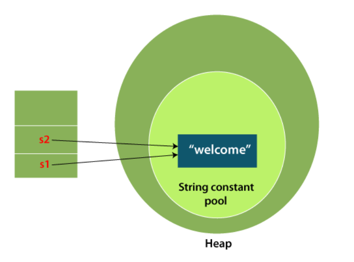

# Strings
* Generally, String is a sequence of characters. But in Java, string is an object that represents a `sequence of characters`. The `java.lang.String` class is used to create a string object.

### How to create a string object?
* There are two ways to create String object:
1. By string literal
2. By new keyword
   
## 1. String Literal
Java String literal is created by using double quotes. For Example:

`String s="welcome";  `
Each time you create a string literal, the JVM checks the "`string constant pool`" first. If the string already exists in the pool, a reference to the pooled instance is returned. If the string doesn't exist in the pool, a new string instance is created and placed in the pool.
```java
String s1="Welcome";  
String s2="Welcome";//It doesn't create a new instance 
```



2. By new keyword
```java
String s=new String("Welcome");//creates two objects and one reference variable  
```
In such case, JVM will create a new string object in normal (non-pool) heap memory, and the literal "Welcome" will be placed in the string constant pool. The variable s will refer to the object in a heap (non-pool).

```java
package Daywise_Notes.Day11;

class StringExample{
    public static void main(String args[]){
        String s1="java";
        String s5="java";
        char ch[]={'s','t','r','i','n','g','s'};
        String s2=new String(ch);
        String s3=new String("example");
        String s4=new String("example");
        String s6=new String("java");

        System.out.println(s1);
        System.out.println(s5);
        System.out.println(s1==s5); // true

        System.out.println(s2);

        System.out.println(s3);
        System.out.println(s4);
        System.out.println(s3==s4); // false

        ///
        System.out.println(s1==s6); // false
    }}

```
### Java String class methods
* The java.lang.String class provides many useful methods to perform operations on sequence of char values.

1	char charAt(int index)	It returns char value for the particular index
2	int `length()`	It returns string length
3	static String format(String format, Object... args)	It returns a formatted string.
4	static String format(Locale l, String format, Object... args)	It returns formatted string with given locale.
5	String substring(int beginIndex)	It returns substring for given begin index.
6	String substring(int beginIndex, int endIndex)	It returns substring for given begin index and end index.
7	boolean contains(CharSequence s)	It returns true or false after matching the sequence of char value.
8	static String join(CharSequence delimiter, CharSequence... elements)	It returns a joined string.
9	static String join(CharSequence delimiter, Iterable<? extends CharSequence> elements)	It returns a joined string.
10	boolean `equals`(Object another)	It checks the equality of string with the given object.
11	boolean `isEmpty()`	It checks if string is empty.
12	String concat(String str)	It concatenates the specified string.
13	String `replace(char old, char new)`	It replaces all occurrences of the specified char value.
14	String replace(CharSequence old, CharSequence new)	It replaces all occurrences of the specified CharSequence.
15	static String `equalsIgnoreCase(String another)`	It compares another string. It doesn't check case.
16	String[] split(String regex)	It returns a split string matching regex.
17	String[] split(String regex, int limit)	It returns a split string matching regex and limit.
18	String intern()	It returns an interned string.
19	int indexOf(int ch)	It returns the specified char value index.
20	int indexOf(int ch, int fromIndex)	It returns the specified char value index starting with given index.
21	int indexOf(String substring)	It returns the specified substring index.
22	int indexOf(String substring, int fromIndex)	It returns the specified substring index starting with given index.
23	String `toLowerCase()`	It returns a string in lowercase.
24	String toLowerCase(Locale l)	It returns a string in lowercase using specified locale.
25	String `toUpperCase()`	It returns a string in uppercase.
26	String toUpperCase(Locale l)	It returns a string in uppercase using specified locale.
27	String trim()	It removes beginning and ending spaces of this string.
28	static String valueOf(int value)	It converts given type into string. It is an overloaded method.

---
