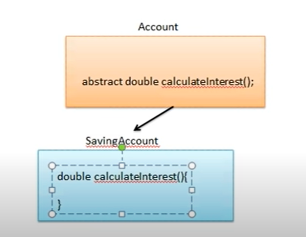

Memory Areas
Abstraction
Abstract class
Abstract method
Interface
abstract vs interface

Another question - Book
---

# Abstract Class

* Abstract class cannot be instantiated.
* `Cannot create object`
* Shape obj = new Shape() - NO
* `Can create reference variable of Abstract class`
* Shape obj = new Circle() - YES
* Used to declare common characteristics of subclasses
* Only be used as superclass who extends it
  
### Why abstract
* Person(name, age) -> Student, Faculty : Generalisation
* No need to create Person Object

# Abstract method
* An abstract class can include methods that contain no implementation. These are called abstract methods. 
* The abstract method declaration must then end with a semicolon rather than a block.
* If a class has any abstract methods, whether declared or inherited, the entire class must be declared abstract.
* `Abstract class => May or may not have Abstract method`
* `Abstract Method => Class must be Abstract`
```java
abstract class Person{
    abstract void show();
}

abstract class Student extends Person{
}

class AbstractExample3{
    public static void main(String[] args) {
         Student s=new Student();
    }
}

```

```java
abstract class Person{
abstract void show();
class Student extends Person{
void show()
{ //some code} I
class AbstractExample3{
public static void main(String[] args){
Students=new Student();
s.show();
}
}
}}}
```
### Why abstract method?


## Summary
1. Abstract class : Can't create object : Shape Class
2. Abstract Method : It forces implementation on subclass
3. Subclass of abstract class having abstract methods has 2 options :
   1. Implement all the abstract methods
   2. Declare your subclass also as abstract

```java
abstract class Shape{

}
// No error
```

```java
class Shape{
    abstract void area();
}
// Error : Class should be abstract too
```

```java
abstract class Shape{

}
class Circle extends Shape{

}
// No error
```

```java
abstract class Shape{
    abstract void area();
}
class Circle extends Shape{

}
// Error : Circle should be abstract or Circle should implement area()
```

```java
abstract class Shape{
    abstract void area();
    abstract void perimeter();
}
class Circle extends Shape{
    void area(){
        // ....
    }
}
// Error : Circle should be abstract or Circle should implement perimeter() as well
```
---
---
