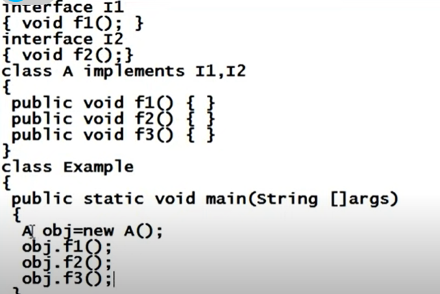
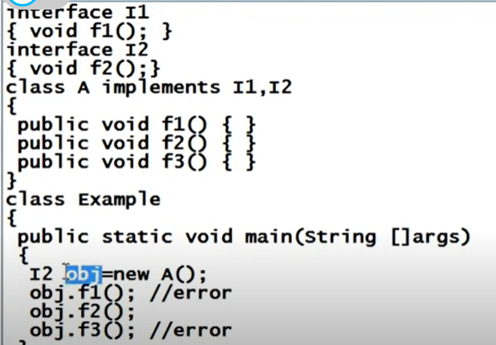

# Interface
* Interact
* An interface like that of an abstract class `cannot be instantiated`.
* `Interface do not have constructors`. 
* Interface v/s Abstract in Constructor : Static var in interface - no relation with onject | Instance var in Abstract class - calls parent constructor with super()
* Interface definition begins with a keyword interface.
`interface SomeName {}`
* Interfaces just specify the method declaration (`implicitly public, static and abstract`) and can only contain fields (which are implicitly `public static final`).
* Interface cannot be instantiated.
* `Cannot create object`
* I1 obj = new I1() NO
* I1 obj = new SubClass() Yes
* `Can create reference variable of Abstract class`


```java
interface Some Name
{
int x;
void someFunction();
}
```
* Implement Interface
```java

interface 11{
void someFunction();
}
class A implements 11 {
I
public void someFunction(){
//some code
}
```
* Craete subclass abstract if does not implement all abstract methods
```java

interface 11{
    void someFunction1();
    void someFunction2();
}
abstract class A implements 11 {
    public void someFunction1(){
    //some code
    }
}
```

### Multiple Inheritance
```java
interface I1{

}
interface I2{
    
}
interface I3 extends I1,I2{
    
}
class A implements I3{
    // implement all abstract() of I1,I2,I3
}

class B extends A implements I3,I2{
    // implement all abstract() of I1,I2,I3
}
````