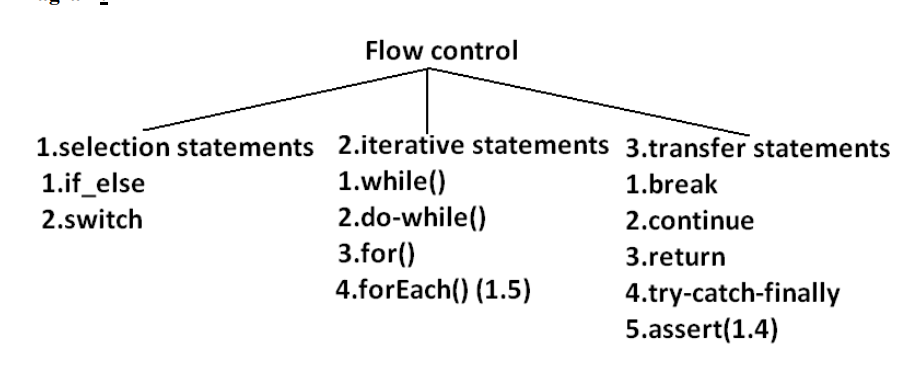

# Flow Control
* Flow control describes the order in which all the statements will be executed at run time. 


# Conditional Statements
* if-else
```java
public class ExampleIf{ 
    public static void main(String args[]){ 
        int x=10; 
        if(x==20) { 
            System.out.println("hello"); 
        }else{ 
            System.out.println("hi"); 
        }
    }
} 

// OUTPUT: 
// Hi 
```

* Switch
```java
public class ExampleSwitch{ 
public static void main(String args[]){ 
    int x=0; 
    switch(x) { 
        default: 
            System.out.println("default"); 
        case 0: 
            System.out.println("0"); 
            break; 
        case 1: 
            System.out.println("1"); 
        case 2: 
            System.out.println("2"); 
        }}} 
OUTPUT: 
X=0 x=1 x=2 x=3 
0   1   2   default 
    2       0 
```