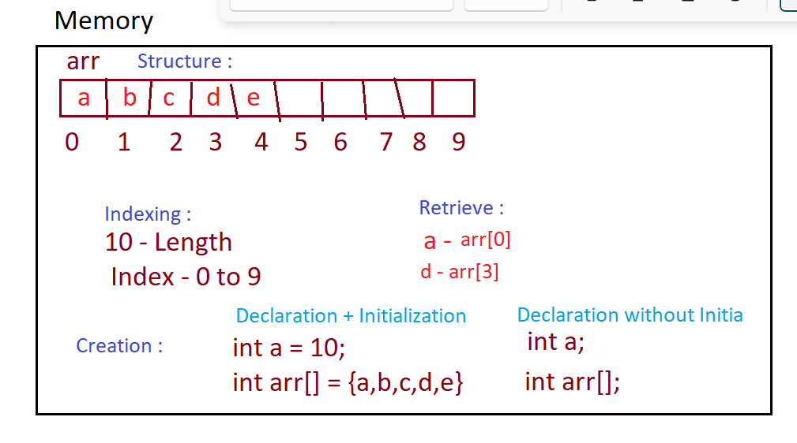

# Data Types 
1. Primitive : int long char float
2. Non-Primitive 

# Arrays
* Stores similar data
* Stores in contiguous manner



# Array
* An array is an indexed collection of fixed number of homogeneous data elements.
* `Advantage` of arrays is we can represent multiple values with the same name so that readability of the code will be improved. 
* `Disadvantage` Fixed in size that is once we created an array there is no chance of increasing or decreasing the size based on our requirement.
* int[] a; //valid 
* int[][] a; 

* int[] a=new int[0]; 
* System.out.println(a.length);//0

* char[] ch={'a','e','i','o','u'};(valid) 
* String[] s={"balayya","venki","nag","chiru"};(valid)


int a[] = {10,20,80} // 1D
a[2] = 80

int a[] = {10 ,{20,90}, 80} //2D
a[1] = {20,90}
a[1][0] = 20

int a[] = {  10 ,{20,90}, {80,56,{1,2}} } //2D
a[0] = 10
a[1] = {20,90}
a[2] = {80,56,{1,2}}

a[2][0] = 80
a[2][1] = 56
a[2][2] = {1,2}

a[2][2][0] = 1

a[2][2][1] = 2


```java
int[][][] a={{{10,20,30},{40,50}},{{60},{70,80},{90,100,110}}};
//             a={
//                 { //0
//                     {10,20,30}, //0
//                     //0  1  2 
//                     {40,50} // 1
//                     //0  1
//                 },
//                 { //1
//                     {60}, //0
//                     {70,80}, //1
//                     {90,100,110} //2
//                 }
//             };
            // a[1] - { //1
            //         {60}, //0
            //         {70,80}, //1
            //         {90,100,110} //2
            //     }
            // a[1][2] - {90,100,110}
            // a[1][2][1] -100
System.out.println(a[0][1][1]);//50(valid) 
System.out.println(a[1][0][2]);//R.E:ArrayIndexOutOfBoundsException: 2(invalid)
System.out.println(a[1][2][1]);//100(valid) 
System.out.println(a[1][2][2]);//110(valid) 
System.out.println(a[2][1][0]);//R.E:ArrayIndexOutOfBoundsException: 2(invalid) 
System.out.println(a[1][1][1]);//80(valid)
```
---