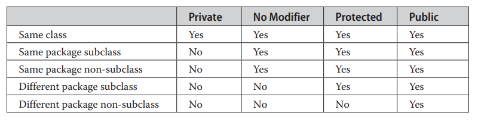

Functions
```java
public class Main {
  static void myMethod(String fname) {
    System.out.println(fname + " Refsnes");
  }

  public static void main(String[] args) {
    myMethod("Liam");
    myMethod("Jenny");
    myMethod("Anja");
  }
}
// Liam Refsnes
// Jenny Refsnes
// Anja Refsnes
```

1. Take Something Return Something
```java
// Define a function : Definition
public static int func(int num){
    System.out.println("num is " + num);
    return (2+10)* num;
}

// Calling a function

int result = func(5);
System.out.println(result);
```

2. Take Something Return Nothing
```java
// Define a function : Definition
public static void func2(int num){
     System.out.println((2+10)* num);
}

// Calling a function

int result = func(5);
System.out.println(result);
```

1. Take Something Return Something
2. Take Something Return Nothing
3. Take Nothing Return Something
4. Take Nothing Return Nothing

* When a parameter is passed to the method, it is called an argument. So, from the example above: fname is a parameter, while Liam, Jenny and Anja are arguments.

# Non-Primitive Data Types
* Multiple values

# <a id="access-modifiers"></a> Access Modifiers

1. private - only same class
2. default - only same pkg
3. protected - not outside pkg, but in subclass which can be outside pkg

#### Private < Default < Protected < Public




instance & static

# Object
An object has three characteristics:

`State`: represents the data (value) of an object.
`Behavior`: represents the behavior (functionality) of an object such as deposit, withdraw, etc.
`Identity`: An object identity is typically implemented via a unique ID. The value of the ID is not visible to the external user. However, it is used internally by the JVM to identify each object uniquely.
# Class
A class in Java can contain:

Fields
Methods
Constructors
Blocks
Nested class and interface

* new keyword in Java
The new keyword is used to allocate memory at runtime. All objects get memory in Heap memory area.
```java
class <class_name>{  
    field;  
    method;  
}  
```
```java
class Student{  
 int id;  
 String name;  
} 

class TestStudent2{  
 public static void main(String args[]){  
  Student s1=new Student();  
  s1.id=101;  
  s1.name="Sara";  
  System.out.println(s1.id+" "+s1.name);//printing members with a white space  
 }  
}  
```

Box - l,b,h, setDimension(), showDimension()

># <a id="Warapper-classes"></a>Wrapper Classes
* Are used to manipulate primitive values as objects.
* Are `final`.
* `Objects of wrapper classes are immutable`.
* Java is not said to be 100% Object Oriented due to its non-object primitive types.
* As a solution to this problem, Java allows us to `include the primitives in the family of objects` by using what are called as Wrapper classes.
* There is a wrapper class for every primitive data types in Java.
```java
int -> Integer
byte -> Byte
```
---

># <a id="package-import"></a> Packages and Import
* Its nothing more than the way we `organize files into different directories` according to their functionality, usability, category they should belong to!
* Different package have different functionality
* java.io - IO related, java.net - Network related
* Help us `avoid class name collision`
* Provides ease of maintenance, organization and increase collaboration among developers
* `import packageName.ClassName`
---

