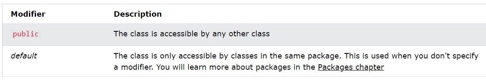
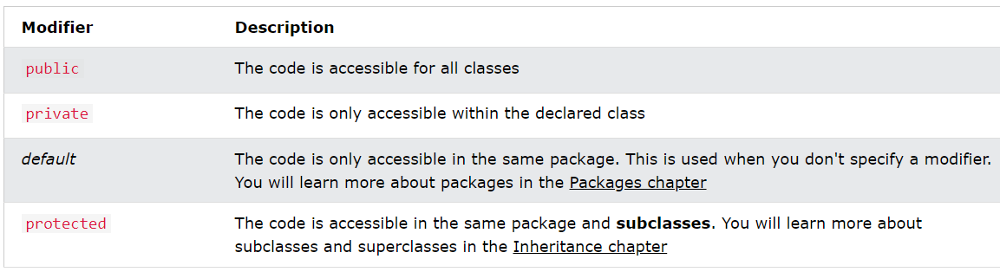
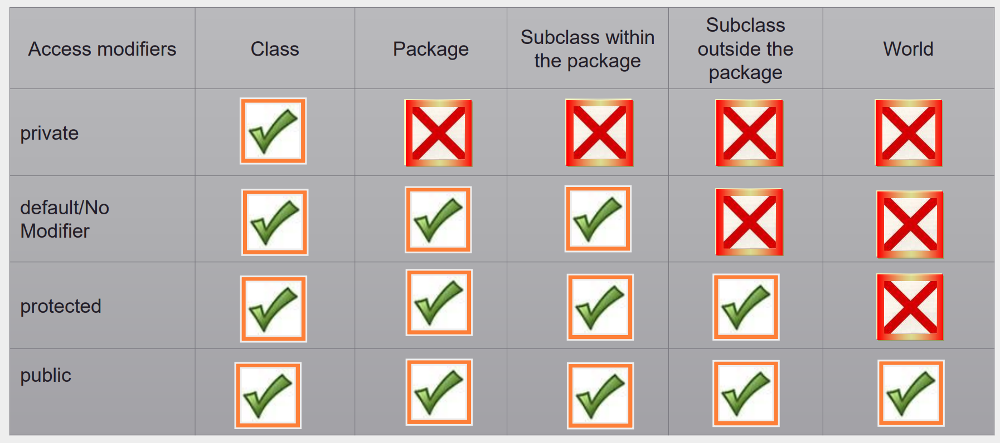
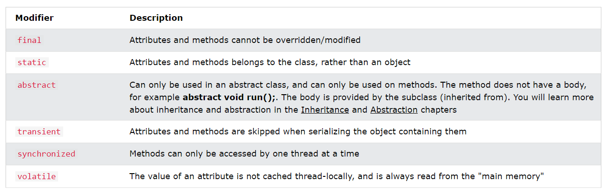

# Naming Convension

* ayushi_jain // snake case
* ayushiJain // camel case

* Variable - snake case or camel case
* Function - snake case or camel case
* Class - Capitalized - prefer camel case
* Constructor - == Class Name

* Java follows camel-case syntax for naming the class, interface, method, and variable.

---
```java
package Daywise_Notes.Day8;

public class Day8 {
    // Properties
    int x1=10;
    static int x2=20;

    // Methods
    public void func1(){
        System.out.println("I am func1");
    }
    public static void func2(){
        System.out.println("I am func2");
    }

    public static void main(String[] args) {
        // Accessing Static Variable and Method
        System.out.println(Day8.x2);
        Day8.func2();

        Day8 obj = new Day8();
        // Accessing Instance Variable and Method
        System.out.println(obj.x1);
        obj.func1();
    }
}
```
### Static v/s Public Methods
* Static method, which means that it can be accessed without creating an object of the class
* Public, which can only be accessed by objects
```java
public class Main {
  // Static method
  static void myStaticMethod() {
    System.out.println("Static methods can be called without creating objects");
  }

  // Public method
  public void myPublicMethod() {
    System.out.println("Public methods must be called by creating objects");
  }

  // Main method
  public static void main(String[] args) {
    myStaticMethod(); // Call the static method
    // myPublicMethod(); This would compile an error

    Main myObj = new Main(); // Create an object of Main
    myObj.myPublicMethod(); // Call the public method on the object
  }
}
```

### Revision
* Create a Car object named myCar. Call the fullThrottle() and speed() methods on the myCar object, and run the program:
```java
// Create a Main class
public class Main {
 
  // Create a fullThrottle() method
  public void fullThrottle() {
    System.out.println("The car is going as fast as it can!");
  }

  // Create a speed() method and add a parameter
  public void speed(int maxSpeed) {
    System.out.println("Max speed is: " + maxSpeed);
  }

  // Inside main, call the methods on the myCar object
  public static void main(String[] args) {
    Main myCar = new Main();   // Create a myCar object
    myCar.fullThrottle();      // Call the fullThrottle() method
    myCar.speed(200);          // Call the speed() method
  }
}

// The car is going as fast as it can!
// Max speed is: 200
```

## Java Constructors
* A constructor in Java is a special method that is used to initialize objects. 
* The constructor is called when an object of a class is created. 
* It can be used to set initial values for object attributes:
```java
// Create a Main class
public class Main {
  int x;  // Create a class attribute

  // Create a class constructor for the Main class
  public Main() {
    x = 5;  // Set the initial value for the class attribute x
  }

  public static void main(String[] args) {
    Main myObj = new Main(); // Create an object of class Main (This will call the constructor)
    System.out.println(myObj.x); // Print the value of x
  }
}

// Outputs 5
```
* The constructor name must match the class name, and it cannot have a return type (like void).
* The constructor is called when the object is created.
* All classes have constructors by default: if you do not create a class constructor yourself, Java creates one for you. However, then you are not able to set initial values for object attributes.

### Parameterised Constructor 
```java
public class Main {
  int x;

  public Main(int y) {
    x = y;
  }

  public static void main(String[] args) {
    Main myObj = new Main(5);
    System.out.println(myObj.x);
  }
}

// Outputs 5
```

---

# Java Modifiers
* We divide modifiers into two groups:

1. `Access Modifiers` - controls the access level
2. `Non-Access Modifiers` - do not control access level, but provides other functionality

## Access modifiers

* For `classes`, you can use either `public or default`
* `Inner class` can be `private or protected`


* For `attributes, methods and constructors`, you can use `public, private, protected or default`


#### Private < Default < Protected < Public


* Non-access modifiers
* For `classes`, you can use either `final or abstract`


* For `attributes and methods`, you can use `final, static, abstract, transient, synchronized, volatile`

---

# Java Inner Classes
* In Java, it is also possible to nest classes (a class within a class). 
* The purpose of nested classes is to group classes that belong together, which makes your code more readable and maintainable.
* To access the inner class, create an object of the outer class, and then create an object of the inner class:
```java
class OuterClass {
  int x = 10;

  class InnerClass {
    int y = 5;
  }
}

public class Main {
  public static void main(String[] args) {
    OuterClass myOuter = new OuterClass();
    OuterClass.InnerClass myInner = myOuter.new InnerClass();
    System.out.println(myInner.y + myOuter.x);
  }
}

// Outputs 15 (5 + 10)

```

## Private Inner Class
* Unlike a "regular" class, an inner class can be private or protected. 
* If you don't want outside objects to access the inner class, declare the class as private:
```java
class OuterClass {
  int x = 10;

  private class InnerClass {
    int y = 5;
  }
}

public class Main {
  public static void main(String[] args) {
    OuterClass myOuter = new OuterClass();
    OuterClass.InnerClass myInner = myOuter.new InnerClass();
    System.out.println(myInner.y + myOuter.x);
  }
}
/// error: OuterClass.InnerClass has private access in OuterClass
// If you try to access a private inner class from an outside class, an error occurs
```

## Static Inner Class
* An inner class can also be static, which means that you can access it without creating an object of the outer class:
```java
class OuterClass {
  int x = 10;

  static class InnerClass {
    int y = 5;
  }
}

public class Main {
  public static void main(String[] args) {
    OuterClass.InnerClass myInner = new OuterClass.InnerClass();
    System.out.println(myInner.y);
  }
}

// Outputs 5
```
---
# Encapsulation
* To make sure that "sensitive" data hidden from users.
* To achieve this, you must:
1. Declare `class variables/attributes` as `private`
2. Provide `public get and set methods`to access and update the value of a private variable

* Private variables can only be accessed within the same class (an outside class has no access to it). However, it is possible to access them if we provide public get and set methods.
```java
public class Person {
  private String name; // private = restricted access

  // Getter
  public String getName() {
    return name;
  }

  // Setter
  public void setName(String newName) {
    this.name = newName;
  }
}

public class Main {
  public static void main(String[] args) {
    Person myObj = new Person();
    myObj.setName("John"); // Set the value of the name variable to "John"
    System.out.println(myObj.getName());
  }
}

// Outputs "John"
```

### Why Encapsulation?
* Better control of class attributes and methods
* Class attributes can be made read-only (if you only use the get method), or write-only (if you only use the set method)
* Flexible: the programmer can change one part of the code without affecting other parts
* Increased security of data

---

# Java Inheritance (Subclass and Superclass)
* Inherit attributes and methods from one class to another

1. subclass (child) - the class that inherits from another class
2. superclass (parent) - the class being inherited from
* To inherit from a class, use the extends keyword.
```java
class Vehicle {
  protected String brand = "Ford";        // Vehicle attribute
  public void honk() {                    // Vehicle method
    System.out.println("Tuut, tuut!");
  }
}

class Car extends Vehicle {
  private String modelName = "Mustang";    // Car attribute
  public static void main(String[] args) {

    // Create a myCar object
    Car myCar = new Car();

    // Call the honk() method (from the Vehicle class) on the myCar object
    myCar.honk();

    // Display the value of the brand attribute (from the Vehicle class) and the value of the modelName from the Car class
    System.out.println(myCar.brand + " " + myCar.modelName);
  }
}
```
* We set the brand attribute in Vehicle to a protected access modifier. If it was set to private, the Car class would not be able to access it.

### Why Inheritance
* It is useful for code reusability: reuse attributes and methods of an existing class when you create a new class.

### The final Keyword and Inheritance
If you don't want other classes to inherit from a class, use the final keyword

---

# Java Polymorphism
* Polymorphism means "many forms", and it occurs when we have many classes that are related to each other by inheritance.
* Inheritance lets us inherit attributes and methods from another class. Polymorphism uses those methods to perform different tasks. This allows us to perform a single action in different ways.
* Sound() in animals and cat, dog..
```java
class Animal {
  public void animalSound() {
    System.out.println("The animal makes a sound");
  }
}

class Cat extends Animal {
  public void animalSound() {
    System.out.println("The Cat says: wee wee");
  }
}

class Dog extends Animal {
  public void animalSound() {
    System.out.println("The dog says: bow wow");
  }
}

class Main {
  public static void main(String[] args) {
    Animal myAnimal = new Animal();  // Create a Animal object
    Animal myCat = new Cat();  // Create a Cat object
    Animal myDog = new Dog();  // Create a Dog object
    myAnimal.animalSound();
    myCat.animalSound();
    myDog.animalSound();
  }
}
```
 