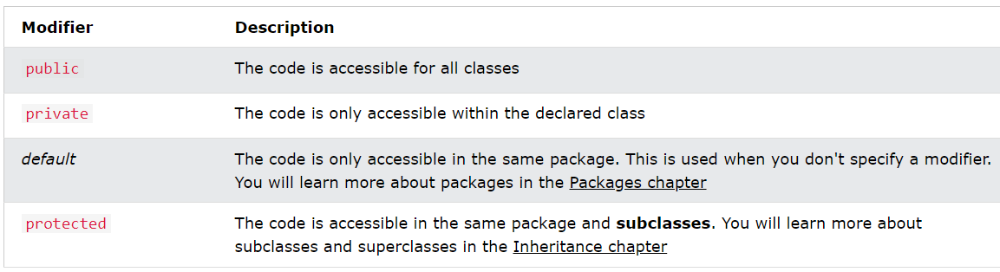
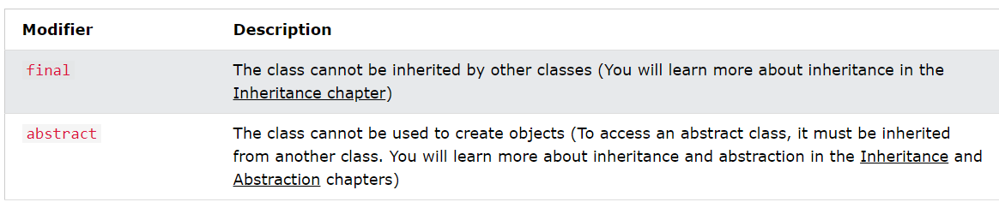
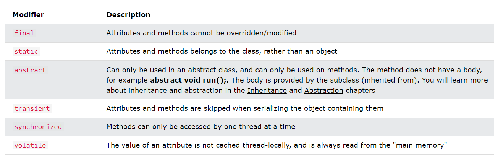

## Java Constructors
* A constructor in Java is a special method that is used to initialize objects. 
* The constructor is called when an object of a class is created. 
* It can be used to set initial values for object attributes:
```java
// Create a Main class
public class Main {
  int x;  // Create a class attribute

  // Create a class constructor for the Main class
  public Main() {
    x = 5;  // Set the initial value for the class attribute x
  }

  public static void main(String[] args) {
    Main myObj = new Main(); // Create an object of class Main (This will call the constructor)
    System.out.println(myObj.x); // Print the value of x
  }
}

// Outputs 5
```
* The constructor name must match the class name, and it cannot have a return type (like void).
* The constructor is called when the object is created.
* All classes have constructors by default: if you do not create a class constructor yourself, Java creates one for you. However, then you are not able to set initial values for object attributes.

### Parameterised Constructor 
```java
public class Main {
  int x;

  public Main(int y) {
    x = y;
  }

  public static void main(String[] args) {
    Main myObj = new Main(5);
    System.out.println(myObj.x);
  }
}

// Outputs 5
```

---

# Java Modifiers
* We divide modifiers into two groups:

1. `Access Modifiers` - controls the access level
2. `Non-Access Modifiers` - do not control access level, but provides other functionality

## Access modifiers

* For `classes`, you can use either `public or default`
* `Inner class` can be `private or protected`


* For `attributes, methods and constructors`, you can use `public, private, protected or default`


#### Private < Default < Protected < Public


* Non-access modifiers
* For `classes`, you can use either `final or abstract`


* For `attributes and methods`, you can use `final, static, abstract, transient, synchronized, volatile`

---

# Java Inner Classes
* In Java, it is also possible to nest classes (a class within a class). 
* The purpose of nested classes is to group classes that belong together, which makes your code more readable and maintainable.
* To access the inner class, create an object of the outer class, and then create an object of the inner class:
```java
class OuterClass {
  int x = 10;

  class InnerClass {
    int y = 5;
  }
}

public class Main {
  public static void main(String[] args) {
    OuterClass myOuter = new OuterClass();
    OuterClass.InnerClass myInner = myOuter.new InnerClass();
    System.out.println(myInner.y + myOuter.x);
  }
}

// Outputs 15 (5 + 10)

```

## Private Inner Class
* Unlike a "regular" class, an inner class can be private or protected. 
* If you don't want outside objects to access the inner class, declare the class as private:
```java
class OuterClass {
  int x = 10;

  private class InnerClass {
    int y = 5;
  }
}

public class Main {
  public static void main(String[] args) {
    OuterClass myOuter = new OuterClass();
    OuterClass.InnerClass myInner = myOuter.new InnerClass();
    System.out.println(myInner.y + myOuter.x);
  }
}
/// error: OuterClass.InnerClass has private access in OuterClass
// If you try to access a private inner class from an outside class, an error occurs
```

## Static Inner Class
* An inner class can also be static, which means that you can access it without creating an object of the outer class:
* Create Object of Static Inner Class
* ```java OuterClass.InnerClass myInner = new OuterClass.InnerClass();```
* Create Object of Instance Inner Class
* ```javaOuterClass.InnerClass myInner = myOuter.new InnerClass();```
```java
class OuterClass {
  int x = 10;

  static class InnerClass {
    int y = 5;
  }
}

public class Main {
  public static void main(String[] args) {
    OuterClass.InnerClass myInner = new OuterClass.InnerClass();
    System.out.println(myInner.y);
  }
}

// Outputs 5
```
---
